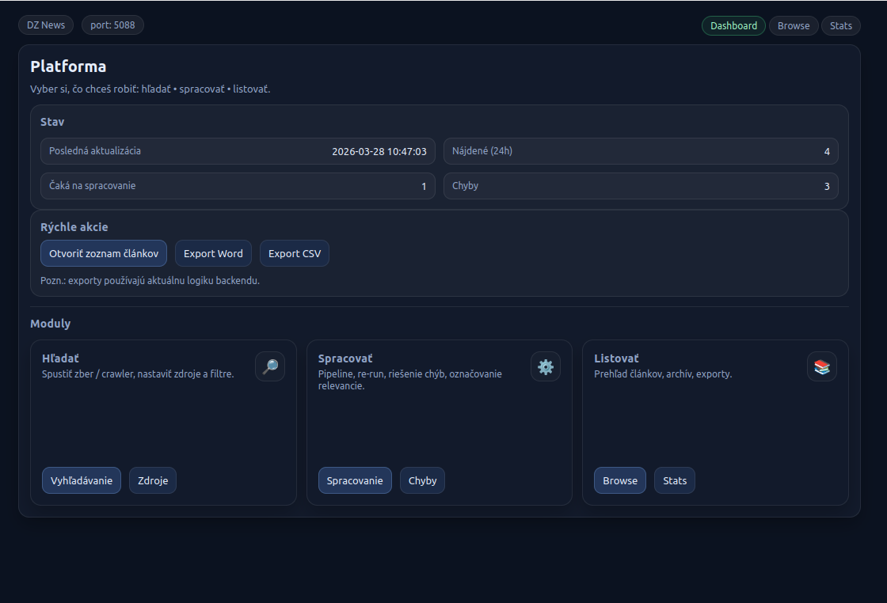

# DZ News Monitor

> **Language / Jazyk / Langue:** [English](#english) · [Slovenčina](#slovenčina) · [Français](#français)


---

## English

### About

**DZ News Monitor** is a Flask web application that tracks Algerian media coverage of Slovakia–Algeria relations. It automatically searches for relevant news articles, extracts their content, and presents them in a review dashboard where articles can be labeled for relevance and exported for analysis.



### Features

- Automated daily news search via **SerpAPI** (Google News)
- Full-text extraction via **trafilatura**
- Arabic → French translation via **DeepL API**
- Relevance labeling and soft-delete workflow
- Export to **Word** and **CSV**
- Scheduled pipeline with **email notifications**
- **Authentication** — admin/read-only access control (session-based, `users` table in DB)
- Dockerized deployment

### Architecture

```
SerpAPI (Google News)
    ↓  search_flow_news.py       — search & save JSON bundles
bundle/news_bundle_*.json
    ↓  ingest_to_dz_news_reworked.py  — parse & insert into DB
MySQL / MariaDB
    ↓  extract_bulk.py           — fetch URLs, extract text, translate AR→FR
    ↓  app.py (Flask)
Web dashboard                    — browse, label, export
```

A `scheduler.py` daemon runs the full pipeline daily and sends an email summary.

### Requirements

- Python 3.12+
- MySQL / MariaDB
- [SerpAPI](https://serpapi.com/) key
- [DeepL API](https://www.deepl.com/pro-api) key (optional, for Arabic translation)
- Docker (for containerized deployment)

### Installation

```bash
git clone https://github.com/eavf/SK_DZ_media.git
cd SK_DZ_media

python -m venv .venv
source .venv/bin/activate
pip install -r requirements.txt
```

Copy `.env.example` to `.env` and fill in your credentials:

```bash
cp .env.example .env
```

### Configuration

Key `.env` variables:

| Variable | Description |
|---|---|
| `SERPAPI_KEY` | SerpAPI key for Google News search |
| `DB_HOST / DB_PORT / DB_NAME / DB_USER / DB_PASS` | MySQL connection |
| `DEEPL_API_KEY` | DeepL API key (optional) |
| `FLASK_SECRET_KEY` | Flask session secret |
| `FLASK_PORT` | Web server port (default: `5088`) |
| `SMTP_HOST / SMTP_USER / SMTP_PASS / NOTIFY_TO` | Email notifications (optional) |

Static config files in `config/`:

| File | Purpose |
|---|---|
| `sources.json` | Preferred Algerian news domains |
| `ranking.json` | Per-domain quality scores |
| `topics.json` | Keyword lists (FR / EN / AR) for topic detection |
| `search_terms.json` | SerpAPI query terms |
| `url_cleanup.json` | Query params stripped from URLs before dedup |

### Usage

**Run the data pipeline manually:**

```bash
# Step 1 – search for articles
python search_flow_news.py

# Step 2 – ingest into database
python ingest_to_dz_news_reworked.py

# Step 3 – extract full text (+ translate Arabic)
python extract_bulk.py
```

**Start the web dashboard:**

```bash
python app.py
# → http://localhost:5088
```

**Run the scheduler (daily automation):**

```bash
python scheduler.py
```

### Authentication

The app uses session-based authentication with two access levels:

| Role | Access |
|---|---|
| Unauthenticated | Browse articles, view article detail, stats |
| Admin | Everything — search, process, label, delete, export, source management |

**Initial setup** (run once after DB is created):

```bash
# 1. Create the users table
mysql -u root dz_news < migrations/001_add_users.sql

# 2. Create the admin account
python create_admin.py
```

### Article date resolution

Each article stores three date-related fields:

| DB field | Description |
|---|---|
| `published_at_text` | Raw date string as returned by SerpAPI (e.g. `"Il y a 5 jours"`, `"2025-12-09"`) |
| `published_at_real` | Parsed datetime used for sorting and display |
| `published_conf` | Confidence label: `search` (from SerpAPI) or `absolute` (from HTML extraction) |

**Processing pipeline:**

```
SerpAPI date field
    ↓ search_flow_news._parse_serp_date()
    │
    ├─ absolute date (e.g. "2025-12-09")
    │       → stored as published_at in bundle JSON
    │       → ingest sets published_at_real, published_conf = 'search'
    │
    └─ relative date (e.g. "yesterday", "il y a 3 jours")
            → NOT stored in bundle — too unreliable for re-surfaced articles
            → published_at_real stays NULL until extraction

HTML extraction (trafilatura via extract_bulk.py / refetch_article.py)
    → reads <meta property="article:published_time"> and similar tags
    → overwrites published_at_real, sets published_conf = 'absolute'
```

**Why relative SerpAPI dates are not used:** Google News can re-surface old articles in new searches. A date like `"yesterday"` is then computed relative to the search time, not the article's true publication date — resulting in values that are months off. Only absolute date strings from SerpAPI are trusted at ingest time; all others are resolved later from the article HTML.

**Maintenance:** `fix_serp_dates.py` can be used to reset any `published_at_real` values that were ingested from relative SerpAPI dates (detects them by matching the raw `published_at_text` against relative-date patterns).

### Docker

```bash
docker compose up --build
```

The image is also available on Docker Hub:

```bash
docker pull eavfeavf/dz-news:latest
```

---

## Slovenčina

### O projekte

**DZ News Monitor** je Flask webová aplikácia na sledovanie alžírskych mediálnych správ o vzťahoch Slovensko–Alžírsko. Automaticky vyhľadáva relevantné články, extrahuje ich obsah a zobrazuje ich v prehľadovom dashboarde, kde ich možno označiť podľa relevancie a exportovať na analýzu.


### Funkcie

- Automatické denné vyhľadávanie cez **SerpAPI** (Google News)
- Extrakcia plného textu cez **trafilatura**
- Preklad arabčiny do francúzštiny cez **DeepL API**
- Označovanie relevancie a soft-delete workflow
- Export do **Word** a **CSV**
- Automatická pipeline s **emailovými notifikáciami**
- **Autentifikácia** — prístupové práva admin / len čítanie (session-based, tabuľka `users` v DB)
- Dockerizované nasadenie

### Architektúra

```
SerpAPI (Google News)
    ↓  search_flow_news.py       — vyhľadávanie a uloženie JSON súborov
bundle/news_bundle_*.json
    ↓  ingest_to_dz_news_reworked.py  — spracovanie a vloženie do DB
MySQL / MariaDB
    ↓  extract_bulk.py           — stiahnutie URL, extrakcia textu, preklad AR→FR
    ↓  app.py (Flask)
Webový dashboard                 — prehľad, označovanie, export
```

`scheduler.py` spúšťa celú pipeline denne a posiela emailový súhrn.

### Požiadavky

- Python 3.12+
- MySQL / MariaDB
- Kľúč [SerpAPI](https://serpapi.com/)
- Kľúč [DeepL API](https://www.deepl.com/pro-api) (voliteľné, pre preklad arabčiny)
- Docker (pre kontajnerizované nasadenie)

### Inštalácia

```bash
git clone https://github.com/eavf/SK_DZ_media.git
cd SK_DZ_media

python -m venv .venv
source .venv/bin/activate
pip install -r requirements.txt
```

Skopíruj `.env.example` do `.env` a vyplň prístupové údaje:

```bash
cp .env.example .env
```

### Konfigurácia

Kľúčové premenné v `.env`:

| Premenná | Popis |
|---|---|
| `SERPAPI_KEY` | Kľúč SerpAPI pre Google News |
| `DB_HOST / DB_PORT / DB_NAME / DB_USER / DB_PASS` | MySQL pripojenie |
| `DEEPL_API_KEY` | Kľúč DeepL (voliteľné) |
| `FLASK_SECRET_KEY` | Secret pre Flask session |
| `FLASK_PORT` | Port webservera (default: `5088`) |
| `SMTP_HOST / SMTP_USER / SMTP_PASS / NOTIFY_TO` | Emailové notifikácie (voliteľné) |

### Použitie

**Manuálne spustenie pipeline:**

```bash
# Krok 1 – vyhľadanie článkov
python search_flow_news.py

# Krok 2 – ingest do databázy
python ingest_to_dz_news_reworked.py

# Krok 3 – extrakcia textu (+ preklad arabčiny)
python extract_bulk.py
```

**Spustenie webového dashboardu:**

```bash
python app.py
# → http://localhost:5088
```

**Spustenie schedulera (denná automatizácia):**

```bash
python scheduler.py
```

### Autentifikácia

Aplikácia používa session-based autentifikáciu s dvoma úrovňami prístupu:

| Rola | Prístup |
|---|---|
| Neprihlásený | Prehliadanie článkov, detail článku, štatistiky |
| Admin | Všetko — vyhľadávanie, spracovanie, označovanie, mazanie, export, správa zdrojov |

**Prvotné nastavenie** (spustiť raz po vytvorení DB):

```bash
# 1. Vytvorenie tabuľky users
mysql -u root dz_news < migrations/001_add_users.sql

# 2. Vytvorenie admin účtu
python create_admin.py
```

### Určovanie dátumu článku

Každý článok uchováva tri dátumové polia:

| Pole v DB | Popis |
|---|---|
| `published_at_text` | Surový reťazec dátumu z SerpAPI (napr. `"Il y a 5 jours"`, `"2025-12-09"`) |
| `published_at_real` | Sparsovaný datetime používaný na zoradenie a zobrazenie |
| `published_conf` | Dôveryhodnosť: `search` (zo SerpAPI) alebo `absolute` (z HTML extrakcie) |

**Procesný postup:**

```
Pole date zo SerpAPI
    ↓ search_flow_news._parse_serp_date()
    │
    ├─ absolútny dátum (napr. "2025-12-09")
    │       → uložený ako published_at v bundle JSON
    │       → ingest nastaví published_at_real, published_conf = 'search'
    │
    └─ relatívny dátum (napr. "yesterday", "il y a 3 jours")
            → NEULOŽENÝ do bundle — nespoľahlivý pre re-surfované staré články
            → published_at_real ostáva NULL až do extrakcie

HTML extrakcia (trafilatura cez extract_bulk.py / refetch_article.py)
    → číta <meta property="article:published_time"> a podobné tagy
    → prepíše published_at_real, nastaví published_conf = 'absolute'
```

**Prečo sa relatívne dátumy zo SerpAPI nepoužívajú:** Google News môže staré články znovu zaradiť do výsledkov vyhľadávania. Dátum ako `"yesterday"` sa potom vypočíta relatívne od času searchu, nie od skutočného dátumu publikovania — výsledok je o mesiace nesprávny. Pri ingeste sa preto dôveruje iba absolútnym reťazcom; ostatné sa doplnia neskôr z HTML článku.

**Údržba:** `fix_serp_dates.py` resetuje prípadné `published_at_real` hodnoty, ktoré boli nastavené z relatívnych dátumov SerpAPI (detekuje ich podľa vzoru v `published_at_text`).

### Docker

```bash
docker compose up --build
```

Image je dostupný aj na Docker Hub:

```bash
docker pull eavfeavf/dz-news:latest
```

---

## Français

### À propos

**DZ News Monitor** est une application web Flask qui surveille la couverture médiatique algérienne des relations Slovaquie–Algérie. Elle recherche automatiquement les articles pertinents, en extrait le contenu et les présente dans un tableau de bord de révision permettant de les étiqueter par pertinence et de les exporter pour analyse.


### Fonctionnalités

- Recherche automatique quotidienne via **SerpAPI** (Google Actualités)
- Extraction du texte intégral via **trafilatura**
- Traduction arabe → français via **l'API DeepL**
- Étiquetage de pertinence et workflow de suppression douce
- Export en **Word** et **CSV**
- Pipeline planifié avec **notifications par e-mail**
- **Authentification** — contrôle d'accès admin / lecture seule (session Flask, table `users` en base)
- Déploiement dockerisé

### Architecture

```
SerpAPI (Google Actualités)
    ↓  search_flow_news.py       — recherche et sauvegarde des bundles JSON
bundle/news_bundle_*.json
    ↓  ingest_to_dz_news_reworked.py  — traitement et insertion en base
MySQL / MariaDB
    ↓  extract_bulk.py           — récupération des URL, extraction, traduction AR→FR
    ↓  app.py (Flask)
Tableau de bord web              — navigation, étiquetage, export
```

Le démon `scheduler.py` exécute le pipeline quotidiennement et envoie un résumé par e-mail.

### Prérequis

- Python 3.12+
- MySQL / MariaDB
- Clé [SerpAPI](https://serpapi.com/)
- Clé [API DeepL](https://www.deepl.com/pro-api) (optionnel, pour la traduction de l'arabe)
- Docker (pour le déploiement conteneurisé)

### Installation

```bash
git clone https://github.com/eavf/SK_DZ_media.git
cd SK_DZ_media

python -m venv .venv
source .venv/bin/activate
pip install -r requirements.txt
```

Copiez `.env.example` en `.env` et renseignez vos identifiants :

```bash
cp .env.example .env
```

### Configuration

Variables clés dans `.env` :

| Variable | Description |
|---|---|
| `SERPAPI_KEY` | Clé SerpAPI pour Google Actualités |
| `DB_HOST / DB_PORT / DB_NAME / DB_USER / DB_PASS` | Connexion MySQL |
| `DEEPL_API_KEY` | Clé DeepL (optionnel) |
| `FLASK_SECRET_KEY` | Secret de session Flask |
| `FLASK_PORT` | Port du serveur web (défaut : `5088`) |
| `SMTP_HOST / SMTP_USER / SMTP_PASS / NOTIFY_TO` | Notifications e-mail (optionnel) |

### Utilisation

**Exécution manuelle du pipeline :**

```bash
# Étape 1 – recherche des articles
python search_flow_news.py

# Étape 2 – ingestion en base de données
python ingest_to_dz_news_reworked.py

# Étape 3 – extraction du texte (+ traduction de l'arabe)
python extract_bulk.py
```

**Démarrage du tableau de bord web :**

```bash
python app.py
# → http://localhost:5088
```

**Démarrage du planificateur (automatisation quotidienne) :**

```bash
python scheduler.py
```

### Authentification

L'application utilise une authentification par session avec deux niveaux d'accès :

| Rôle | Accès |
|---|---|
| Non connecté | Navigation des articles, détail article, statistiques |
| Admin | Tout — recherche, traitement, étiquetage, suppression, export, gestion des sources |

**Configuration initiale** (à exécuter une fois après la création de la base) :

```bash
# 1. Créer la table users
mysql -u root dz_news < migrations/001_add_users.sql

# 2. Créer le compte admin
python create_admin.py
```

### Résolution de la date des articles

Chaque article stocke trois champs liés à la date :

| Champ DB | Description |
|---|---|
| `published_at_text` | Chaîne brute renvoyée par SerpAPI (ex. `"Il y a 5 jours"`, `"2025-12-09"`) |
| `published_at_real` | Datetime analysé utilisé pour le tri et l'affichage |
| `published_conf` | Niveau de confiance : `search` (SerpAPI) ou `absolute` (extraction HTML) |

**Pipeline de traitement :**

```
Champ date de SerpAPI
    ↓ search_flow_news._parse_serp_date()
    │
    ├─ date absolue (ex. "2025-12-09")
    │       → stockée comme published_at dans le bundle JSON
    │       → l'ingestion définit published_at_real, published_conf = 'search'
    │
    └─ date relative (ex. "yesterday", "il y a 3 jours")
            → NON stockée dans le bundle — trop peu fiable pour les anciens articles re-surfacés
            → published_at_real reste NULL jusqu'à l'extraction

Extraction HTML (trafilatura via extract_bulk.py / refetch_article.py)
    → lit <meta property="article:published_time"> et balises similaires
    → écrase published_at_real, définit published_conf = 'absolute'
```

**Pourquoi les dates relatives de SerpAPI ne sont pas utilisées :** Google News peut remettre en avant d'anciens articles dans de nouvelles recherches. Une date comme `"yesterday"` est alors calculée par rapport à l'heure de la recherche, et non à la date de publication réelle — ce qui peut donner un résultat décalé de plusieurs mois. Seules les chaînes de dates absolues de SerpAPI sont fiables à l'ingestion ; les autres sont résolues ultérieurement depuis le HTML de l'article.

**Maintenance :** `fix_serp_dates.py` réinitialise les valeurs `published_at_real` éventuellement définies à partir de dates relatives SerpAPI (détectées par correspondance de motif dans `published_at_text`).

### Docker

```bash
docker compose up --build
```

L'image est également disponible sur Docker Hub :

```bash
docker pull eavfeavf/dz-news:latest
```

---

*Developed for monitoring Slovak–Algerian media relations.*